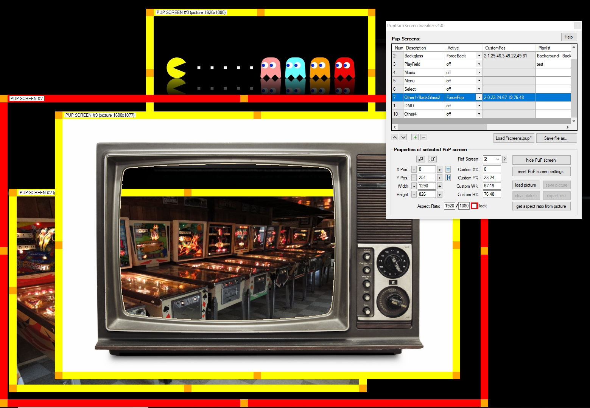

# PupPackScreenTweaker

**To all PuP-Pack creators:** here is a little tool to help you visually positioning your PuP screens.

- Get a real size preview of what your PuP-Pack layout will look like when playing.
- Precisely adjust size and position of the PuP screens, and tweak their aspect ratio.
- Load images and video still frames into the PuP screens, to verify how your overlays and underlays will combine with the video clips on the screen, all this with only few clicks.
- And most importantly… Stop having to use a calculator to come up with good “CustomPos” numbers… Let the software do it for you!

## Installation

1. Download the [latest release](https://github.com/matd11/PupPackScreenTweaker/releases/tag/v1.0)
2. Place the PupPackScreenTweaker.exe file in your PinUpSystem folder, easy!

## Getting started

1. Click on the “load screens.pup” button and browse to the “screens.pup” file from the PuP-Pack you want to work with. The software will read its content and display windows on your screen accordingly.
2. Go from one screen to another in the data grid list to select them. Only the selected screen (highlighted in red) can have its properties changed.
3. Use the bottom part of the user interface to change the appearance of the PuP screens by entering new numbers in the text fields.
4. You can also drag the PuP screens with the mouse to move and resize them graphically.
5. CustomPos values are constantly re-calculated for you when properties of the screens are changed!
6. Click on the “+” button to add a new PuP screen to your layout. Click on “-” to delete one.
7. Use the up and down arrow buttons to change the order of the PuP screens in the list.
8. Feel free to load images or video previews into the PuP screens to help you position them.
9. Use the various fields in the data grid to change PuP properties of the PuP screens.
10. Once happy with the layout, click on “save as” to write a new screens.pup file

## Tips

1. Screens with the “Active” attribute set to “off” won't be displayed when loading the screens.pup file. You can display them by selecting the matching line in the datagrid and clicking on the “show screen” button
2. Check your aspect ratios! Load an image or a video into a PuP screen, click on “get aspect ratio from picture” and tick the “Aspect ratio lock” checkbox… This way you know your video will display correctly during the game.
3. PuP screens cannot be moved beyond their reference screens. Reference screens are defined in your PinUp Popper preferences. As an example, PuP screens for which the reference screen is 2 cannot be moved outside of your backglass area. Reference screen 0 is for the topper. If you click on the “?” next to the “Ref. Screen” combobox, you'll get the coordinates and sizes of all the reference screens.
4. Changing the order of the PuP screens in the list has an effect on the way they are displayed during the game (it changes the Z order of screens)
5. The ability to load images or video still frames in PuP screens is just here to help you visually organizing your layout and check aspect ratios, it has no impact on the “screens.pup” file.

## Hybrid display db2s/pinup

If you want to experiment with an hybrid display using both a db2s backglass and a PuP-Pack, this tool can help too… Just load your “screens.pup” file and add a new screen to it. Click on “load image” and instead of selecting a \*.png file, pick a \*.db2s file. Adjust its position/size on screen, in order for it to fit well with your PuP-Pack. Click on the “export res file” button. It will create a file you can use to automatically put the db2s at this position next time you run the game. Before saving your “screens.pup”, remove the PuP screen you added with the d2bs (or at least, put its “Active” field to “off”). You'll find more info about how \*.res files work at this [link](http://www.nailbuster.com/wikipinup/doku.php?id=b2s_dimension_location).

**A huge thanks to Nailbuster and TerryRed for the [PinUp System and all its themes and add-ons](https://vpinball.com/VPBdownloads/categories/pinup-system-installer-and-tools/)! Definitely the best "game changer" there is!**
